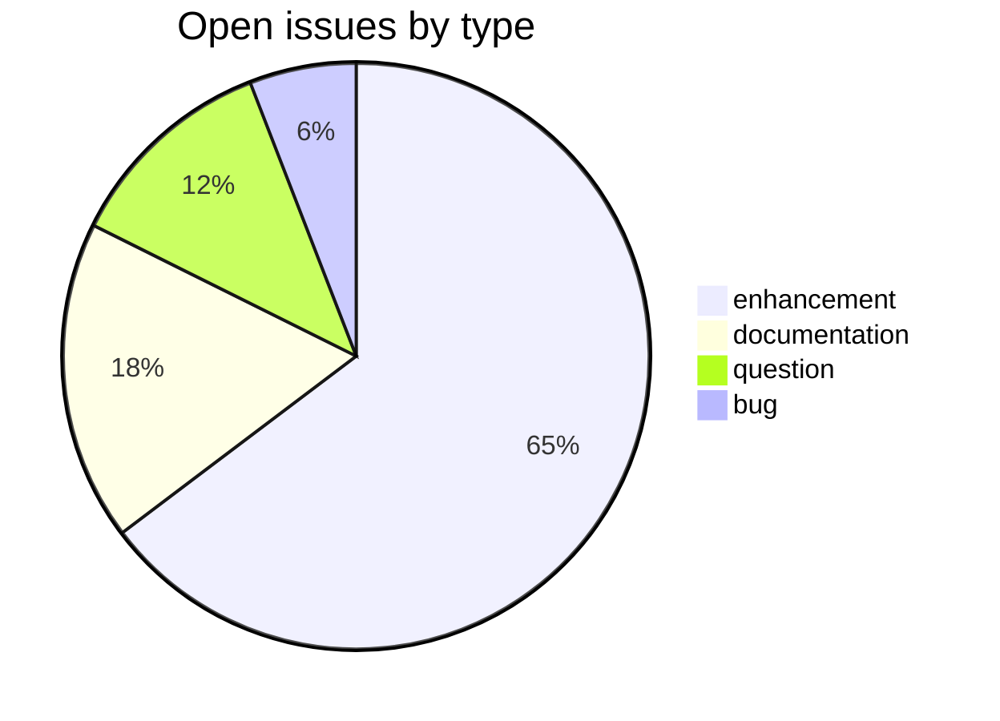
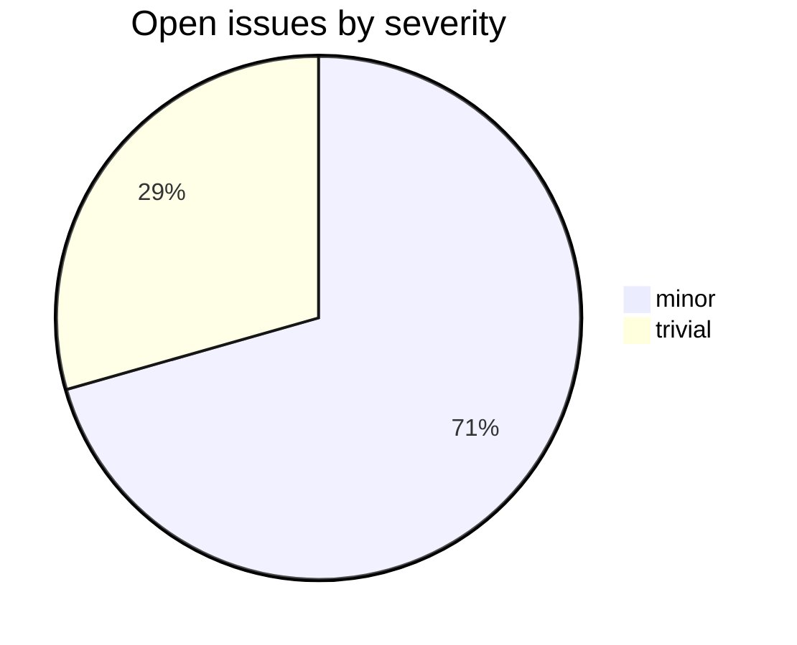

# mw-dev

CDSL **web-backend** repository in the Sanskrit Lexicon project.
Development version of the MW dictionary, used to collaborate with Andhrabharati.

## Tech Stack

- **Runtime**: PHP
- **Build**: PHP dev workflow
- **Input**: MW XML source from `csl-orig`
- **Output**: revised MW XML / web-display assets

## Issues Overview

Snapshot 2026-05-29: 17 open.

### By Milestone

| Milestone | Open | Closed | Total |
|---|---:|---:|---:|
| API Stability | 0 | 0 | 0 |
| User Experience | 11 | 0 | 11 |
| Data Quality | 1 | 0 | 1 |
| Developer Experience | 3 | 0 | 3 |
| Community | 2 | 0 | 2 |

### By Type

### By Severity

## GitHub Issue Conventions

Follows the [Cologne tooling-repo taxonomy](https://github.com/sanskrit-lexicon/csl-observatory/blob/main/runbook/cologne-tooling-runbook.md):

- **17 type labels** across 5 categories
- **4 severity levels**: trivial, minor, major, critical
- **5 milestones**: API Stability, User Experience, Data Quality, Developer Experience, Community
- **Domain labels** scoped to web-backend: `domain:api`, `domain:auth`, `domain:db`, `domain:caching`
- **Org Project**: [Tooling Roadmap](https://github.com/orgs/sanskrit-lexicon/projects/9)

See [CLAUDE.md](CLAUDE.md) for full definitions.

---
*Generated by Cologne Tooling Runbook on 2026-05-29*
