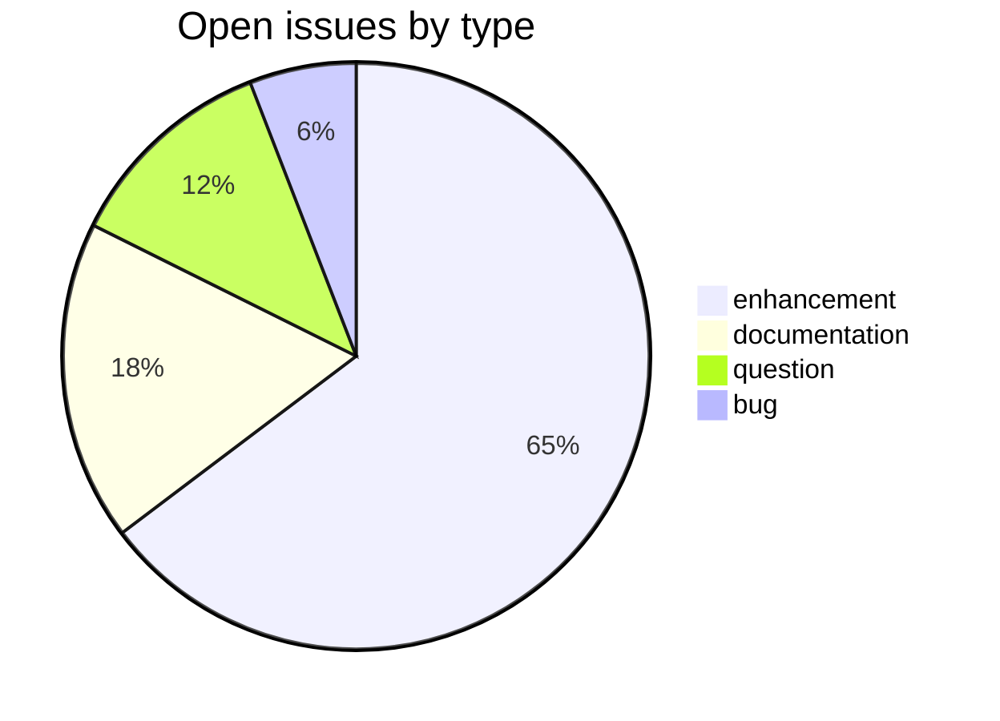
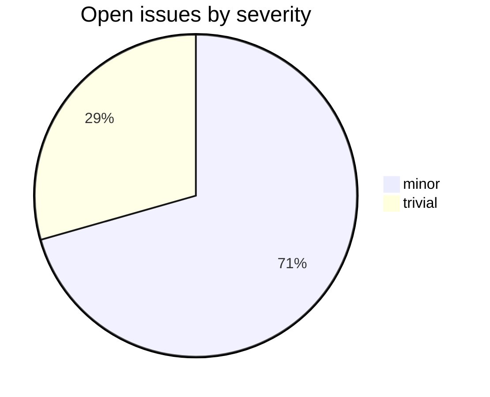

# mw-dev

_Created: 03-07-2026 · Last updated: 11-07-2026_

CDSL **web-backend** repository in the Sanskrit Lexicon project.
Development version of the MW (Monier-Williams) dictionary, used to collaborate
with Andhrabharati.

## Tech Stack

- **Languages**: PHP (web display), Python (headword/XML tooling), shell scripts
- **Input**: MW text/XML source from [`csl-orig`](https://github.com/sanskrit-lexicon/csl-orig)
- **Output**: revised MW XML plus web-display assets
- **Layout**:
  - [`orig/`](https://github.com/sanskrit-lexicon/mw-dev/tree/main/orig) — source MW text and transcode inputs
  - [`pywork/`](https://github.com/sanskrit-lexicon/mw-dev/tree/main/pywork) — Python headword/XML build scripts
  - [`web/`](https://github.com/sanskrit-lexicon/mw-dev/tree/main/web) — PHP web front-end (`index.php`), fonts, JS, sqlite assets
  - [`downloads/`](https://github.com/sanskrit-lexicon/mw-dev/tree/main/downloads) — packaged artifacts and `redo_*.sh` rebuild scripts
  - [`abcode/`](https://github.com/sanskrit-lexicon/mw-dev/tree/main/abcode) — Andhrabharati collaboration code

## Issues Overview

Snapshot 11-07-2026: **17 open, 6 closed**.

### Open issues by milestone

| Milestone | Open |
|---|---:|
| API Stability | 0 |
| User Experience | 11 |
| Data Quality | 1 |
| Developer Experience | 3 |
| Community | 2 |

All 6 closed issues to date are `enhancement` / `minor` and carry no milestone.

### Open issues by type

### Open issues by severity

## GitHub Issue Conventions

Follows the [Cologne tooling-repo taxonomy](https://github.com/sanskrit-lexicon/csl-observatory/blob/main/runbook/cologne-tooling-runbook.md):

- **Type labels** across the tooling categories (`bug`, `feature`, `enhancement`,
  `performance`, `tech-debt`, `security`, `documentation`, `infrastructure`, `question`)
- **4 severity levels**: `trivial`, `minor`, `major`, `critical`
- **5 milestones**: API Stability, User Experience, Data Quality, Developer Experience, Community
- **Domain labels** scoped to web-backend: `domain:api`, `domain:auth`, `domain:db`, `domain:caching`
- **Org Project**: [Tooling Roadmap](https://github.com/orgs/sanskrit-lexicon/projects/9)

See [`CLAUDE.md`](https://github.com/sanskrit-lexicon/mw-dev/blob/main/CLAUDE.md) for full definitions.

## License

This repository contains both source code and dictionary/data files, which are
licensed separately:

- **Source code** (e.g. `*.py`, `*.php`, `*.js`, `*.sh`) is licensed under the
  **GNU General Public License v3.0** — see [`licenses/GPL-3.0.txt`](https://github.com/sanskrit-lexicon/mw-dev/blob/main/licenses/GPL-3.0.txt).
- **Dictionary and data files** are licensed under **Creative Commons
  Attribution-ShareAlike 4.0 International (CC-BY-SA-4.0)** — see
  [`LICENSE`](https://github.com/sanskrit-lexicon/mw-dev/blob/main/LICENSE).

_Dr. Mārcis Gasūns_
